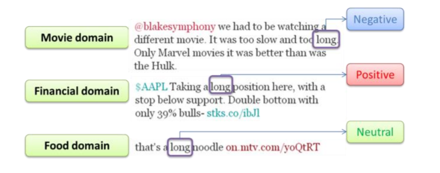
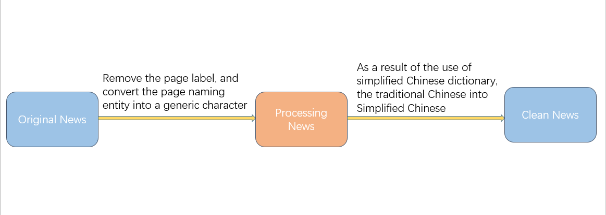
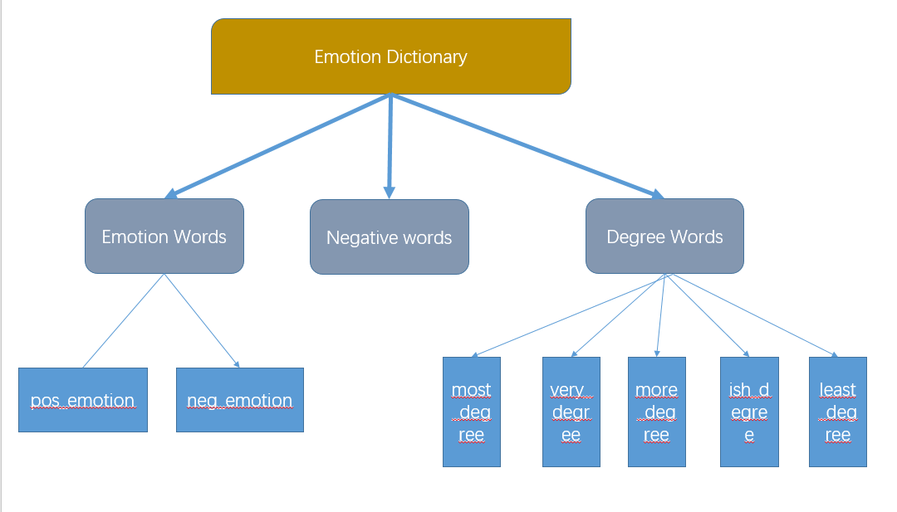
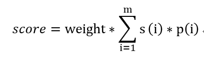
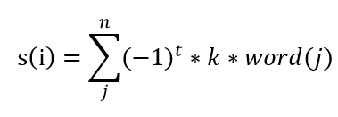
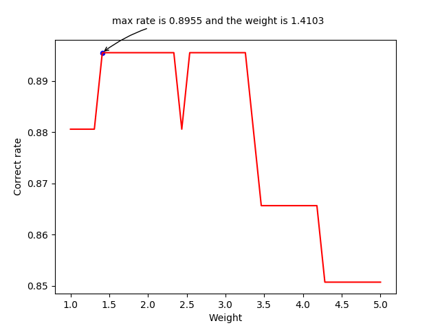
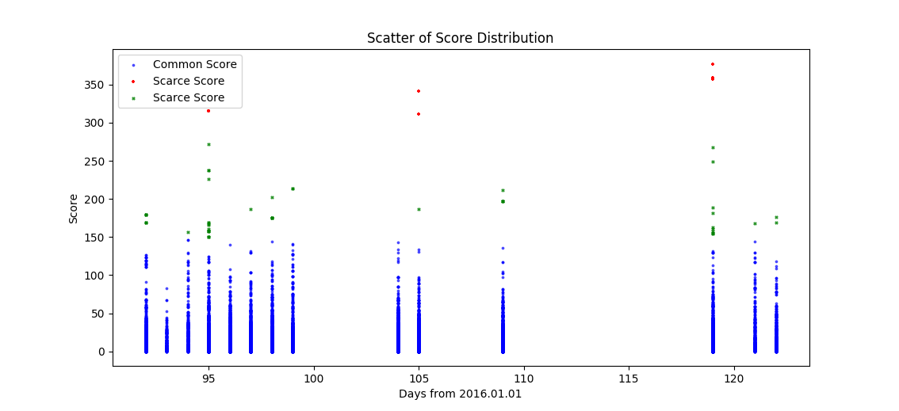
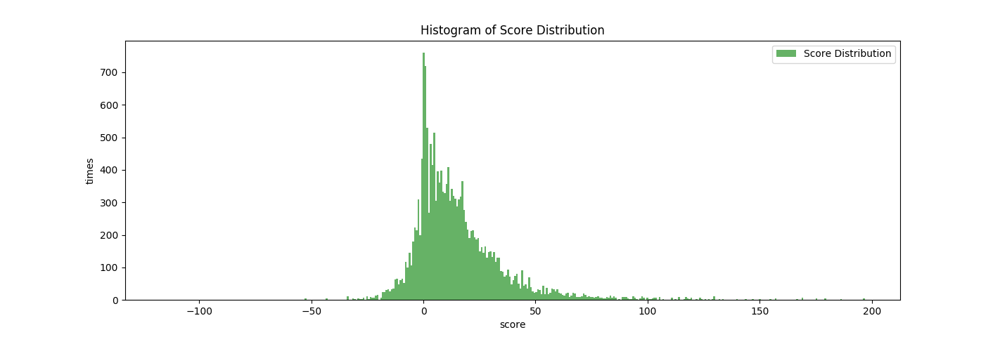

# **基于词汇的金融文本情感分析**

Author:YuanXin Dong 
Teacher:Junjie Li 
ShenZhen University,CN 
Email:xiaochiyijiu@163.com

## **摘要**
&nbsp;&nbsp;&nbsp;&nbsp;&nbsp;&nbsp;&nbsp;&nbsp;当今社会媒体的发展导致了金融舆论数据的爆炸式增长。因此，针对金融舆论数据的情感分析受到广大股民和金融公司的热切关注。目前，情感分析应用主要分为两种：基于词汇的方法和机器学习方法。当然，它们都面临着获取大量人类标记训练数据和语料的挑战。我提出一种基于词汇的针对金融数据情感分析的方法：将一篇短文本划分为不同的部分并给予不同的权重，再以词汇为基本颗粒进行分数计算；同时，在已有的权威字典的基础上，针对性的添加或修改金融方面的词汇，并且使用N-Gram方法来进行新词的挖掘，最终获得更好的性能。

## **1. 介绍**
&nbsp;&nbsp;&nbsp;&nbsp;&nbsp;&nbsp;&nbsp;&nbsp;近年来，随着Web的发展，金融舆论的数据呈现爆炸式的增长，如何从海量数据中发现有用的信息并且得到对应的模型成为许多公司和企业关注的焦点。 
&nbsp;&nbsp;&nbsp;&nbsp;&nbsp;&nbsp;&nbsp;&nbsp;诚然，目前没有一种模型可以含括所有的领域，也没有一种字典囊括不同领域的术语。 

&nbsp;&nbsp;&nbsp;&nbsp;&nbsp;&nbsp;&nbsp;&nbsp;根据需求，我们将精力放在了金融领域，并且采集了不同来源的高质量的数据集。同时，我们对一个包含大多数领域的字典进行了修改，添加和修改了金融方面的专业词汇。由于金融数据的直观性、简洁性特点，我们忽略了词汇之前的同义、反义等复杂关系，讲更多的精力投入在对于极性的确定和极性程度的判定方面。在此基础上，设计了一个实用的衡量金融文本感情的算法模型。

## **2. 数据准备**
### **2.1 数据来源**

&nbsp;&nbsp;&nbsp;&nbsp;&nbsp;&nbsp;&nbsp;&nbsp;数据的获取来自不同的平台，平台主要为以下几个： 
- 香港上市公司的年报和半年报
- 香港线上金融媒体的新闻报告
- 海外金融数据
- 各大金融论坛的帖子
- 社交平台的金融大V的动态

&nbsp;&nbsp;&nbsp;&nbsp;&nbsp;&nbsp;&nbsp;&nbsp;需要声明的是，算法模型是以最具有代表性的香港线上金融媒体的新闻报告为基础进行测试和训练的，在此基础上推广到其他平台的文本。

### **2.2 数据清洗**

&nbsp;&nbsp;&nbsp;&nbsp;&nbsp;&nbsp;&nbsp;&nbsp;为了保留新闻媒体对于关键词的标注，在数据采集的时候保留了相应的网页标签和繁体风格。之后的检查工作中发现网页的标签的用处可以忽略不计，因此将原来的网页文本清洗成了简体无标签的文本形式。

&nbsp;&nbsp;&nbsp;&nbsp;&nbsp;&nbsp;&nbsp;&nbsp;正如上图所示，考虑到之后使用的是简体中文字典，因此需要将原始文本进行相应的转换。转换后的文本存储在MySQL和电脑的文本格式文件中。

## **3. 词典**

### **3.1 词典来源**
&nbsp;&nbsp;&nbsp;&nbsp;&nbsp;&nbsp;&nbsp;&nbsp;因为算法模型是基于词汇的情感分析，所以字典的准确性和灵活度对于结果的影响至关重要。字典来自知网的情感词库，原始字典按照习惯将词汇分为三大类：
1. 情感词
    - 积极评价词
    - 积极情感词
    - 消极评价词
    - 消极情感词
2. 程度词：从最重的most程度依次降低到least程度，共5个等级。
3. 否定词

&nbsp;&nbsp;&nbsp;&nbsp;&nbsp;&nbsp;&nbsp;&nbsp;基于以上特点，否定词的存在可以用来判别是否进行词汇的极性反转，程度词的存在可以给予不同的情感词不同的分数，而情感词可以整合成积极词和消极词两部分。基于知网词库的以上特点，将此词库选做基本的情感词典。

### **3.2 词典的数据类型**

&nbsp;&nbsp;&nbsp;&nbsp;&nbsp;&nbsp;&nbsp;&nbsp;为了让后期的程序更好的调用词典，并且让其他人员更容易的修改词典，将文本txt格式的词典按照分类不同放在不同命名的列表中，使得对应的逻辑更直观，方便其他程序调用。

### **3.3 词典的修改**
&nbsp;&nbsp;&nbsp;&nbsp;&nbsp;&nbsp;&nbsp;&nbsp;由于知网的词典是针对所有的领域，因此在金融领域词汇的划分上不免有失偏颇，前期我采用人工的方法对词典的三大分类进行了略微调整。调整如下：
1. 在积极词(pos_emotion)中删除了`要,用,开通,需,向,应,欲,通,深,对,会,长,常,上,经济,主要,红,幽,灵,颖,硬,不变,是,明显,约,刚,刚刚,到,事实上,基,基部,基础,基础性,固,固定,可乐,谨,主导,自行`,增加了`'坚挺','新高','利好','放宽','提升','看好','优于','高于','扭转','买超','强劲','反弹','增','缓解','微升','划算','升高','进展','上升','落实','涨','回升','高开','上涨'`。
2. 在消极词(neg_emotion)中删除了`大，怊，悭，悱，愦，胜，偏`,增加了`'倒退','下试','不利因素','紧缩','劝退','乏力','齐挫','贸易矛盾','矛盾','拖累','回落','负债','跌','跳水','鸡肋','沙尘暴','阴霾','钱荒','压力','贬值','利淡','下降','造淡','极端','欠佳','走低','急跌','重挫','周跌','月跌','连跌','背驰','缩减','妨碍','强拆','批评','故障','致歉','减速','减弱','恶化','下滑','严重','急转直下','灰飞烟灭','偏软','丑闻','贪污','倒退','急挫','挫','低见','跌','冲击','大跌','涉嫌','亏损','下跌','纪律处分','处分','赤字','缩水','打击','开门黑','降低','追讨','违法','警告','阴影','变数','不佳','落幕','违法行为','违约金','欺诈','隐患','暴跌','跌穿','受压','连累'`
3. 在否定词中删除了`偏`,增加了`'无','不','不是'`
4. 在程度词中增加了`'百分之百','非常','重大',"大幅",'半点','小幅'`

### **3.4 命名实体的添加**
&nbsp;&nbsp;&nbsp;&nbsp;&nbsp;&nbsp;&nbsp;&nbsp;由于分词采用的是第三方Jieba词库[1]，为了改善分词情况，对于金融领域常见的命名实体，例如：美联储（金融机构）、吉利汽车（公司/企业）、港股（股票）等进行了添加，以此来减少分词的错误率，提高算法准确度。

## **4. 情感分词算法**

### **4.1 文本分块**
&nbsp;&nbsp;&nbsp;&nbsp;&nbsp;&nbsp;&nbsp;&nbsp;一篇文本，通常由不同的部分的组成，而每个部分的重要程度不同。对于一篇金融新闻，在文本长度足够的情况下，给定`'FORWARD_NUM'`，`'BACKWARD_NUM'`这两个参数，分别代表[0:FORWARD_NUM]句和[BACKWARD_NUM-1:]句。这两部分分数的权重(Weight)相比于中间部分[FORWARD_NUM:BACKWARD_NUM]的权重更高。 
&nbsp;&nbsp;&nbsp;&nbsp;&nbsp;&nbsp;&nbsp;&nbsp;当然，当一篇文本过短时，我们认为它不够足够长来进行分块，即[0:FORWARD_NUM]∩[BACKWARD_NUM-1:]≠∅，此时将忽视`'FORWARD_NUM'`，`'BACKWARD_NUM'`这两个参数，全文采用统一权重来计算分数。 
&nbsp;&nbsp;&nbsp;&nbsp;&nbsp;&nbsp;&nbsp;&nbsp;为了减少首尾权重(Weight)对于文本整体的影响过大，以至于算法忽略文本[FORWARD_NUM:BACKWARD_NUM]部分的分数，我们将首尾的部分得出的分数乘以对应的频率，即：

*公式：用于[0:FORWARD_NUM]和[BACKWARD_NUM-1:]两部分。其中s对应每部分积极或消极情感分数，p对应每部分积极词或消极词的频率，w是每部分的权重。*

### **4.2 积极词/消极词**
&nbsp;&nbsp;&nbsp;&nbsp;&nbsp;&nbsp;&nbsp;&nbsp;对于中文(无边界语言)划分词语，考虑到速度和第三方库的发现新词能力，我们使用了jieba分词库。将文本中的积极词和消极词结合词典挑选出来，并且每个给予一个分数，在此基础上，我们进行极性反转和程度词的发现。 

#### **4.2.1 极性反转**
&nbsp;&nbsp;&nbsp;&nbsp;&nbsp;&nbsp;&nbsp;&nbsp;词语的极性不一定只由本身决定，一些否定词的使用会让词语的极性反转。考虑以下两种最常见的情况('\'号代表jieba词库的分词结果)：
1. 不是\不好
2. 不是\很\不好

因此可以发现需要在词语的位置向前搜索1或2个位置，来查找否定词，然后进行极性反转。

#### **4.2.2 程度词搜索**
&nbsp;&nbsp;&nbsp;&nbsp;&nbsp;&nbsp;&nbsp;&nbsp;对于不同的情感词，每个情感词的分数绝对值的大小取决于程度词。因此类似于极性反转，程度词的搜索采取相同的模式，这里，我们也考虑两种常见的情况('\'号代表jieba词库的分词结果)：
1. 非常 不 好吃
2. 不是 很 好吃

&nbsp;&nbsp;&nbsp;&nbsp;&nbsp;&nbsp;&nbsp;&nbsp;由此可见，程度词的出现位置和否定词相似。同样的，我们在词汇的位置处向前搜索1或2个位置，根据程度词的程度大小，对分数乘以不同的系数。

#### **4.2.3 公式计算**
&nbsp;&nbsp;&nbsp;&nbsp;&nbsp;&nbsp;&nbsp;&nbsp;因此，之前的公式右式中的**(i)**可以写成下面的格式：

*公式：-1的指数t取决于是否极性反转，k代表的是程度词的程度，word(j)是每个词的原始分数。*

### **4.3 基于程度词频的优化**
&nbsp;&nbsp;&nbsp;&nbsp;&nbsp;&nbsp;&nbsp;&nbsp;实际运行过程中，我发现程序的时间很长，尤其是针对长文本的时候。究其原因，是在之前的极性反转和程度词的判断中，为了穷尽常见的情况，子分支的判断语句非常多。为了减少程序在子分支语句方面判断的时间损耗，采用赫夫曼树[2]的优化思想：将`'if-else'`理解成二叉树，由于不同的程度词在日常语言中出现的频率是不同的，因此，可以将`'more_degree'`和`'ish_degree'`首先判断，再依次判断`'very_degree'`、`'most_degree'`和`'least_degree'`，来达到树的加权路径最小的目的，实现对算法性能的优化。

### **4.4 首尾权重的调优**
&nbsp;&nbsp;&nbsp;&nbsp;&nbsp;&nbsp;&nbsp;&nbsp;在第一个公式中，针对首尾两部分的情感分数的计算是有参数`'weight'`。这里我挑选了2017年5月份第一个交易周的所有样本进行了人工新闻情感的标注。在此基础上，设置`'weight'`的调整步长为0.1，从1开始，以(1,5]为区间，计算每个`'weight'`的得到的准确度，来选出最优的`'weight'`参数。

&nbsp;&nbsp;&nbsp;&nbsp;&nbsp;&nbsp;&nbsp;&nbsp;从图中显而易见的看到，正确率最高是89.55%，对应的权重是1.4103。因此，我们将权重设置为1.4103。

### **4.5 分数界线的确定**
&nbsp;&nbsp;&nbsp;&nbsp;&nbsp;&nbsp;&nbsp;&nbsp;在实际的测试过程中，我发现一些情况下，当分数过大的时候，结果往往是不准确的。比如有些时候分数达到
惊人的40多分，文本信息容量过大，不能简单说其是积极或消极或中性的。为了解决这一难题，首先忽略分数的符号，即：取分数的绝对值(`|score|`)；然后选取以测试样本最多和时间最靠近的2016上半年，统计分数的在上半年的情况。结果如下图所示。

&nbsp;&nbsp;&nbsp;&nbsp;&nbsp;&nbsp;&nbsp;&nbsp;容易发现，150分以上的分数出现的概率非常小（样本容量17710）。因此，我们在之后的分析中，针对这个算法模型得出的分数，专门检查150分数以上对应的新闻，由此来确定突发情况或者识别无用的新闻。在此基础上，我又选取了2016年全年的新闻分数，并且做出了相应的频率分布直方图。

&nbsp;&nbsp;&nbsp;&nbsp;&nbsp;&nbsp;&nbsp;&nbsp;这里，没有忽略正负值，从图形的面积可以发现，在一个年度中，新闻报道积极情感居多。而在分数的最大值区间，基本同2016上半年的情况。

## **5. 致谢**
&nbsp;&nbsp;&nbsp;&nbsp;&nbsp;&nbsp;&nbsp;&nbsp;**感谢罗旺师姐和各位师兄师姐过程中的指点和帮助O(∩_∩)O~。**

\[1]:[Jieba词库的学习和介绍](https://yq.aliyun.com/articles/26040) 
\[2]:[赫夫曼树的思想和构建](https://baike.baidu.com/item/%E5%93%88%E5%A4%AB%E6%9B%BC%E6%A0%91/2305769?fr=aladdin) 
\[3]:参考《Automatic domain-specific sentiment lexicon generation with label propagation》